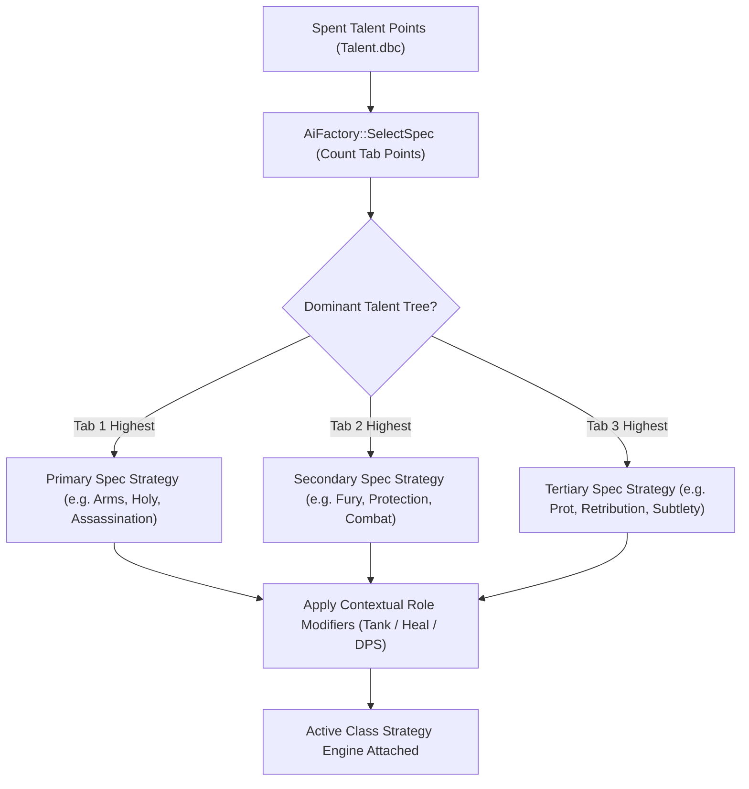

# Class AI & Roles Overview

TortoiseBots implements comprehensive AI for all **nine Vanilla classes** (Warrior through Druid), with full spec awareness, rotational priorities, and support for **Turtle WoW 1.18.1** custom spells and talents.

## Supported Roles & Classes

| Class | Tank | Healer | Melee DPS | Ranged DPS | Crowd Control (CC) | Interrupts |
| :--- | :---: | :---: | :---: | :---: | :--- | :--- |
| **[Warrior](warrior.md)** | ✅ (Prot) | ❌ | ✅ (Arms/Fury) | ❌ | Intimidating Shout, Concussion Blow | Shield Bash, Pummel |
| **[Paladin](paladin.md)** | ✅ (Prot) | ✅ (Holy) | ✅ (Ret) | ❌ | Hammer of Justice, Repentance | None (Hammer of Justice stun) |
| **[Hunter](hunter.md)** | ❌ | ❌ | ✅ (Survival Melee) | ✅ (BM/MM) | Freezing Trap, Scare Beast | Scatter Shot |
| **[Rogue](rogue.md)** | ❌ | ❌ | ✅ (All Specs) | ❌ | Sap, Blind, Gouge | Kick |
| **[Priest](priest.md)** | ❌ | ✅ (Holy/Disc) | ❌ | ✅ (Shadow) | Shackle Undead, Psychic Scream, Chastise | Silence (Shadow) |
| **[Shaman](shaman.md)** | ❌ | ✅ (Resto) | ✅ (Enh) | ✅ (Ele) | None | Earth Shock |
| **[Mage](mage.md)** | ❌ | ❌ | ❌ | ✅ (All Specs) | Polymorph | Counterspell |
| **[Warlock](warlock.md)** | ❌ | ❌ | ❌ | ✅ (All Specs) | Fear, Seduce, Banish | Spell Lock (Felhunter) |
| **[Druid](druid.md)** | ✅ (Bear) | ✅ (Resto) | ✅ (Cat) | ✅ (Balance) | Entangling Roots, Hibernate | Feral Charge / Bash |

---

## Spec Detection & Strategy Selection

The bot's combat strategy is determined dynamically by analyzing its spent talent points (`AiFactory::SelectSpec`):
- **Dominant Talent Tree:** The bot tallies spent talent points across the three class tabs. Whichever tree has the highest allocation determines the active combat strategy (e.g. Arms vs Fury vs Protection for Warriors).
- **Hybrid Support:** Hybrid classes adapt based on context. For example, a Feral Druid switches to Bear form when tanking or Cat form when DPSing.
- **Dynamic Role Assignment:** In party groups, the player can designate bot roles (Tank, Healer, DPS) which adjusts multiplier weights for aggro generation, healing urgency, and positioning.

---

## Shared Bot Behaviors

| Shared Subsystem | Trigger Condition | Bot Action / Behavior | Configuration / Control |
| :--- | :--- | :--- | :--- |
| **Resting & Recovery** | Out-of-combat, HP < 60% or Mana < 40% | Sits down, consumes food/water simultaneously | Automatic; pauses when group moves |
| **Buffs & Imbues** | Buff missing on self/party, duration < 5m | Recasts class buffs (Arcane Intellect, PW:F, MotW) and poisons | Automated out-of-combat maintenance |
| **Targeting & Assist** | Leader/Tank enters combat | Assists master's target; honors Skull focus and CC exclusions | `.bot action focus skull`, CC mark priority |
| **Looting & Gathering** | Dead corpse or nearby resource node | Navigates to corpse, loots quest items, rolls Greed/Need | `AiPlayerbot.RollBadItemsWithPlayer` |
