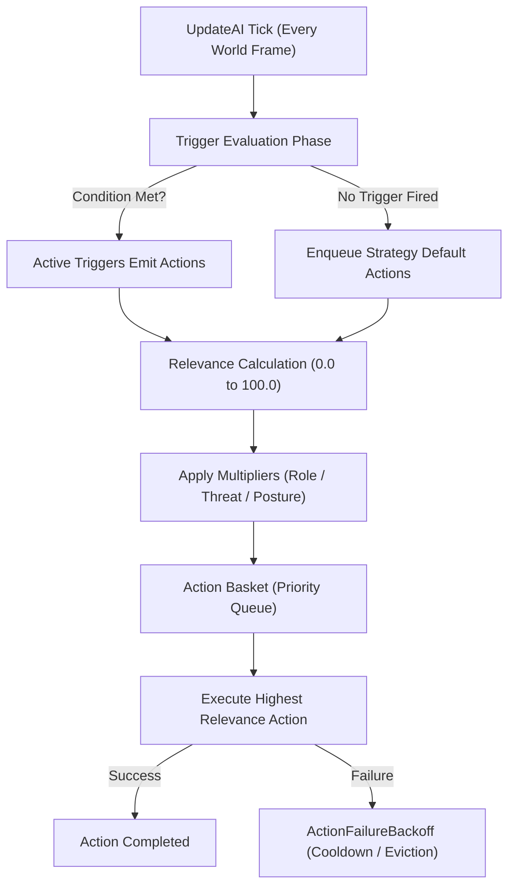

# Strategy Engine & Action Scheduling

TortoiseBots uses an action-scheduling engine derived from Playerbots. Rather than running a monolithic behavior tree or hardcoded FSM, bot behavior emerges from composable **Strategies**, **Triggers**, **Actions**, and **Multipliers**.

## The Execution Cycle

## Core Building Blocks

| Component | Responsibility | Example Class / Implementation | Relevance / Effect |
| :--- | :--- | :--- | :--- |
| **Strategy** | High-level posture or intent container | `FrostMageStrategy`, `HealStrategy`, `PullbackStrategy` | Registers triggers, actions, and defaults |
| **Trigger** | Context condition check | `CriticalHealthTrigger`, `LowManaTrigger`, `EnemyCastTrigger` | Evaluates boolean state (`isTriggered()`) |
| **Action** | Concrete world interaction or spell cast | `CastFlashHealAction`, `ReachSpellAction`, `EatAction` | Returns `true` on execution success |
| **Multiplier** | Contextual relevance adjuster | `RoleMultiplier`, `ThreatMultiplier`, `DistanceMultiplier` | Scales base action score (e.g. 1.5x, 0.0x) |
| **Backoff** | Anti-looping failure throttling | `ActionFailureBackoff` in `Engine.cpp` | Exponential TTL suppression on repeated failure |

---

## Action Relevance Tiers

The engine evaluates actions on a continuous priority scale from `0.0` to `100.0`:

| Relevance Tier | Score Range | Typical Actions | Context & Intent |
| :---: | :---: | :--- | :--- |
| **Emergency** | `90.0 – 100.0` | Emergency healing (*Lay on Hands*, *Shield Wall*), emergency interrupts, self-dispel | Party member near death, lethal boss cast incoming |
| **High Tactical** | `70.0 – 89.0` | Tactical crowd control (*Polymorph*, *Freezing Trap*), pullback retreat, taunt on healer aggro | Maintaining tactical control, peeling mobs off cloth casters |
| **Standard Combat** | `40.0 – 69.0` | Rotational damage spells, standard melee attacks, refreshing dots/debuffs | Normal DPS rotation when threat and health are stable |
| **Low / Filler** | `20.0 – 39.0` | Wand attacks, auto-shots, pet maintenance | Mana conservation, low-priority chip damage |
| **Out-of-Combat** | `1.0 – 19.0` | Follow master, sit to eat/drink, buff group members, loot corpses | Non-combat maintenance when all hostility has ceased |
