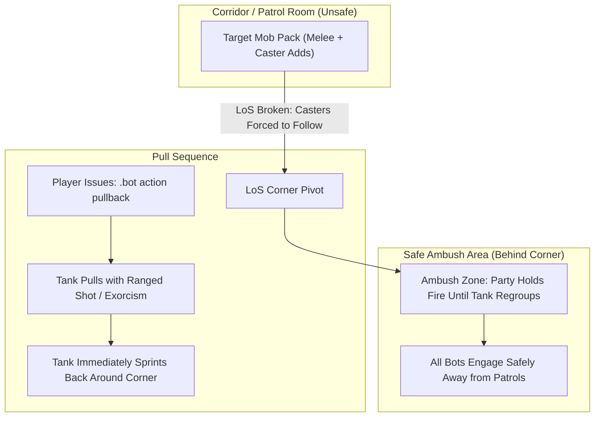

# Dungeon & Raid Tactics Guide

Running 5-player dungeons with companion bots is one of the most rewarding ways to experience Vanilla and Turtle WoW. However, dungeon mobs hit hard, patrol packs add unexpectedly, and casters flee into adjacent rooms. 

This guide outlines practical field tactics to ensure smooth dungeon runs without unnecessary wipes.

---

## 1. The Five Golden Rules of Bot Dungeoneering

1. **Pull to LoS Corners, Don't Charge:** Use `.bot action pullback` so the tank pulls and runs back to you around a corner. Never let bots fight out in open corridors where patrols roam.
2. **Toggle AoE OFF on CC Packs:** Before pulling packs where you plan to *Polymorph* or *Sap*, run `.bot action aoe off`. This prevents Mages (*Blizzard*), Warlocks (*Rain of Fire*), and Hunters (*Multi-Shot*) from accidentally breaking crowd control.
3. **Always Mark the Primary Target with Skull:** Issue `.bot action focus skull`. All DPS bots will focus their single-target burst exclusively onto that target until it dies.
4. **Give the Tank Two Seconds:** Tanks tab-target *Sunder Armor* and *Torment* based on lowest personal threat. Give them 2–3 seconds to establish initial aggro before nuking.
5. **Keep `.bot summon` Ready:** If a bot gets stuck on tricky instance terrain (like Blackrock Depths stairs or Gnomeregan elevators), `.bot summon` snaps them directly to you out of combat.

---

## 2. Pulling Mechanics & Line-of-Sight (LoS)

Open corridors are death traps in dungeons like Deadmines, Scarlet Monastery, and Stratholme. Casters stand at 30 yards casting fireballs while melee mobs surround your healer.

### The Pullback Maneuver (`.bot action pullback`)
When you target an enemy mob and issue `.bot action pullback`:
1. The server identifies your party's designated tank (Warrior, Bear Druid, or Paladin).
2. The tank uses a ranged attack (Bow, Gun, Thrown, or *Exorcism*) or charges in, applies immediate threat, and immediately sprints back to your party's current location.
3. Non-tank bots hold fire until the tank reaches the regroup anchor, drawing the entire mob pack safely around the corner into your ambush.



---

## 3. Crowd Control (CC) Protocol

Crowd control is essential for multi-caster pulls in level 40+ dungeons.

### Standard Raid Target Icon Assignments

| Raid Icon | Primary Class & Ability | Valid Targets | Notes |
| :---: | :--- | :--- | :--- |
| **Moon** | **Mage** (*Polymorph*) / **Rogue** (*Sap*) | Beasts, Humanoids | Rogue must be in stealth prior to pull for Sap. |
| **Star** | **Priest** (*Shackle Undead*) | Undead only | Crucial in Stratholme, Scholomance, and Shadowfang Keep. |
| **Diamond** | **Warlock** (*Banish* / *Seduce*) | Demons, Elementals | Banish completely immunizes target from damage. |
| **Triangle** | **Hunter** (*Freezing Trap*) / **Druid** (*Hibernate*) | Beasts, Dragonkin | Hunter drops trap; tank guides mob over the trap. |

### Issuing CC In-Game
* Target the mob you want CC'd and type:
  ```text
  .bot action cc moon
  # Or click the Moon button under CC Marks in /tbm
  ```
* The server selects an available bot capable of executing that CC and enqueues the action.
* **Automatic Discipline:** Once applied, party bots and pets are strictly blocked from attacking the crowd-controlled target until all other active threats are dead.

---

## 4. Wipe Recovery & Instance Navigation

If your group wipes, follow this checklist to recover quickly:

### Releasing Spirit & Corpse Runs
1. When dead, whisper your bots `/w <BotName> release` (or type `.bot command <Name> release`).
2. Once in ghost form at the graveyard, issue `/w <BotName> corpse run`.
3. Ghost bots will path organically back to the instance portal and zone inside.
4. If a bot gets stuck outside the dungeon entrance, simply zone in yourself and type `.bot summon` to gather them safely at the instance threshold.

### Elevators, Boats & Ledges
* In complex vertical dungeons (Gnomeregan, Sunken Temple, Blackrock Spire), bots can occasionally desync when jumping down ledges or riding elevators.
* Always wait for bots at the bottom of elevators or after ledge drops, then click **Summon** in `/tbm` to regroup before engaging the next pack.

---

## 5. Dungeon Loot & Item Upgrades

### Loot Rolling Rules
* Bots participate in standard party loot rolls (`Need`, `Greed`, `Pass`).
* **Need on Empty Slots (`AiPlayerbot.RollBadItemsWithPlayer = 1`):** When enabled in `aiplayerbot.conf`, party bots will roll Need on dungeon blue/green drops only if their matching gear slot is empty or severely under-leveled, ensuring fair loot distribution without hoarding items you need.

### Reagents & Food Sharing
* If you have a Mage bot in your group, they automatically conjure food and water out of combat and initiate direct trades (`/w <Name> trade`) to replenish mana-using party members.
* To force an owned bot to equip a dropped dungeon item from their bags:
  ```text
  .bot command <BotName> equip [Item Link]
  ```
